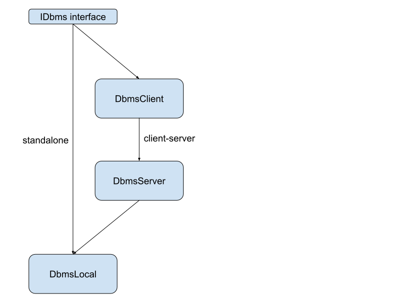
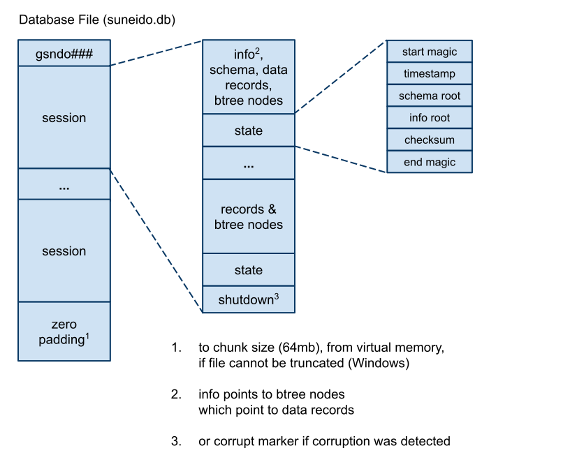

- [Introduction](#introduction)
- [Overview](#overview)
- [Source Code Layout](#source-code-layout)
- [Tests and Benchmarks](#tests-and-benchmarks)
- [Portable Tests](#portable-tests)
- [Language](#language)
	- [Values](#values)
	- [Operations](#operations)
	- [Numbers](#numbers)
		- [Decimal Floating Point](#decimal-floating-point)
		- [Integers](#integers)
	- [Strings](#strings)
		- [Concatenation](#concatenation)
	- [Exceptions](#exceptions)
	- [Objects](#objects)
	- [Records](#records)
	- [Classes](#classes)
		- [Private Class Members](#private-class-members)
		- [Getters](#getters)
	- [Functions and Methods](#functions-and-methods)
		- [Arguments](#arguments)
		- [Parameters](#parameters)
		- [Passing Arguments to Parameters](#passing-arguments-to-parameters)
	- [Iterators and Sequences](#iterators-and-sequences)
- [Compiler](#compiler)
	- [Byte Code](#byte-code)
	- [Interpreter](#interpreter)
- [Libraries](#libraries)
	- [Library Tags](#library-tags)
	- [Implementation](#implementation)
- [Windows Interface](#windows-interface)
	- [COM](#com)
	- [SuneidoAPP](#suneidoapp)
- [Concurrency](#concurrency)
- [Database](#database)
	- [Storage](#storage)
	- [Shutdown and Startup](#shutdown-and-startup)
	- [Database File Structure](#database-file-structure)
	- [Repair](#repair)
	- [Packing](#packing)
		- [Objects](#objects-1)
		- [Records](#records-1)
	- [Indexes](#indexes)
	- [Optimizations](#optimizations)
		- [Btrees](#btrees)
		- [ixbuf](#ixbuf)
	- [Transactions](#transactions)
	- [Repair](#repair-1)
	- [Metadata](#metadata)
	- [Queries](#queries)
		- [Query Optimization](#query-optimization)
			- [Transform](#transform)
			- [Fixed](#fixed)
		- [Fast Single](#fast-single)
		- [Mode](#mode)

# Introduction

This document explains the design and implementation of gSuneido, the Go implementation of Suneido.

This is not a guide or reference to using Suneido. See the Users Manual for that.

This is a work in progress. It will likely never be "complete". But it may be useful to maintainers (including me) and might be of interest to people implementing or interested in this kind of software.

# Overview

- Has its own byte code and interpreter
- Suneido values (including integers and strings) implement the Value interface, however there are no wrapper types (other than Go interfaces)
- Uses panic and recover to implement exceptions
- 64 bit
- The portable version (without the Windows interface) runs on Linux and Mac as well as Windows.

# Source Code Layout

- makefile
- gsuneido.go
- **options** - command line options
- **core** - the interpreter and the core built-in types
- **compile** - lexer, parser, AST, byte code generation
- **builtin** - built-in functions and classes, including the Windows interface
- **dbms** - the dbms client and server
- **db19** - the database implementation
- **cmd** - miscellaneous command line utilities
- **res** - windows resources
- **util** - low level general purpose utilities

Source file names starting with "su" are usually the language level implementation. e.g. dnum.go is the internal implementation, sudnum.go is the Value wrapper.

# Tests and Benchmarks

Uses the Go testing framework.

# Portable Tests

To reduce the duplication of tests in the different implementations, there are "portable tests". These tests are contained in text files in their own repository (<https://github.com/apmckinlay/suneido_tests>)

The files are designed to be read by the Suneido lexer/scanner and executed by "fixtures" that must be written for each implementation.

See also <http://thesoftwarelife.blogspot.ca/2014/05/portable-tests.html>

# Language

## Values

See core/value.go

Suneido is a dynamically typed language. Variables may hold different types at different times.

Some types have multiple internal representations. Numbers can be either small integers or decimal floating point. Strings can be either simple strings, deferred concatenations, or exceptions (with an attached call stack). This is mostly invisible at the Suneido language level. It means that we have to canonicalize values in SuObject so e.g. ob[5] is the same whether the 5 is an integer or a dnum.

Values implement the Value interface (core/value.go). Most values also implement the Packable interface (core/pack.go)

Value types can embed ValueBase (core/valuebase.go) to get default method implementations.

## Operations

See core/ops.go

Operations are implemented "externally", they are not part of the Value interface.

## Numbers

Results of calculations are not narrowed - too much overhead.

Divide handles even integer division specially. Running the ETA tests found roughly 1/3 of divides were even integer divisions. Benchmark went from 43 ns to 14 ns and the extra case doesn't seem to slow down normal usage.

Many things treat false and "" as zero. However, the first argument to ranges and string subscripts do not.

### Decimal Floating Point

See util/dnum.go and core/sudnum.go

Numbers in Suneido are stored in **decimal** floating point so that decimal fractions (like .1) can be represented exactly.

This means we can't use the **binary** floating point numbers normally provided by hardware and languages.

Dnum has a 64 bit coefficient, an 8 bit sign, and an 8 bit exponent. Only 16 of the possible 19 decimal digits are used. This allows splitting into two 8 decimal digit halves which fit into 32 bits for faster processing.  The coefficient is kept “maximized” i.e. “shifted” left as far as possible.

See also [Bit Twiddling (Dnum)](https://thesoftwarelife.blogspot.com/2018/03/bit-twiddling.html)

### Integers

See core/suint.go

Although Suneido only has one kind of number (decimal floating point), for performance integers are internally handled separately.

In earlier versions of Go, integers were automatically stored within interfaces - perfect for Suneido - but this was removed so the garbage collector would not have to deal with non-pointer values.

At first glance, it appears Go can't support immediate (non-heap) integers in interfaces but it turns out it is possible.

The way to work within Go’s type safety is to use pointers into a large array of bytes. If we make the array 64 kB then we can handle 16 bit integers. We don't actually store anything in the array and we don't initialize it, so it doesn't take up any physical memory. So a small immediate integer type can be created with:

```Go
type smi byte
const range = 1 << 16
var space [range]smi
func NewSmi(i int) interface{} {
    return &space[i]
}
```

We can then define methods on *smi to support the Value interface. (core/suint.go)

To get the integer back out of the pointer we have to use the unsafe package, but in a safe way :-)

Because they are pointers, they can be stored in Go interfaces (like Value) without allocation, unlike the Go integer types.

See also [Go Interfaces and Immediate Integers](https://thesoftwarelife.blogspot.com/2017/09/go-interfaces-and-immediate-integers.html)

## Strings

Suneido strings are just byte strings. They are not zero terminated and can contain arbitrary binary data. Normally they hold 7 bit ascii characters.

### Concatenation

Suneido does not require the use of a “string builder”. It optimizes concatenation so it can be used to build large strings efficiently.

See core/ops.go OpCat

If the result of concatenating two SuStr's is small it uses a normal Go string concatenation. Otherwise it creates an SuConcat (core/suconcat.go) which is a byte slice that can be appended to and converted back to a Go string or SuStr without allocation. (Since the byte slice is never modified, just appended to.)

## Exceptions

See SuExcept in core/suexcept.go

Exceptions in Suneido are strings, but they also have a Callstack attached.

Concatenating onto an exception maintains the exception information.

Go doesn't have try-catch like C++ or Java. However, it does have panic and recover which gSuneido uses to implement try-catch primarily in core/interp.go

## Objects

See core/suobject.go

In Suneido, an "object" is a general purpose data structure combining a list/array (a slice of Value) and a hash map. The hash map is not a native Go map because of their limitations on key types. The hash map implementation is in util/hmap/hmap.go

Objects are a good fit for function call arguments, with unnamed arguments in the list part, and named arguments in the map part.

In Suneido, ob.name is equivalent to ob["name"]

ob[num] may be in the list or map part. Contiguous members starting at 0 (zero) are in the list part. All other members, including numeric, are in the map part. Values are automatically moved between the list and map as necessary to maintain this. For example, if we have members 0,1,2 in the list part and 4,5,6 in the map part, and we inserted member 3, then 4,5,6 would be "migrated" to the list part.

object.Copy is copy on write. This is useful to minimize the overhead of "defensive" copies since they won't actually be copied unless modified.

## Records

Records are primarily used for reading and writing to the database.

Currently, a record is an object with the addition of rules and observers. Records with rules and observers are also useful in user interface code.

Records originating from the database are kept internally in the database Row form and only unpacked lazily. See [Packing](#packing)

However, in the future the list part may be removed (it is seldom used) and the map part may be restricted to string keys like [Classes](#classes)

## Classes

Classes and instances of classes were originally just objects with the addition of a class reference. Later classes and instances became maps from strings (member names) to values. (No unnamed list members.)

### Private Class Members

Suneido fakes private members by prefixing them with their class name. e.g. in MyClass a private member foo becomes MyClass_foo. Although this is primarily an implementation detail, these members are visible to Suneido code and tests take advantage of this. However, we avoid bypassing privacy in actual application code.

Anonymous classes are given a system generated internal name (e.g. Class123) for privatization.

Privatization is done at compile time, for class members like:

`foo: 123`

and for member references like:

`.foo`

### Getters

If code reads a member that does not exist, Suneido will look for a "getter" i.e. a method that will provide the value, either Getter_(name) or getter_name or Getter_Name

Private getters e.g. getter_foo() are privatized to Getter_MyClass_foo

## Functions and Methods

### Arguments

We need to handle passing named arguments and @args while efficiently handling simple calls (the majority) with minimal overhead.

Ideally we want to be able to call functions from native code relatively easily.

Arguments are passed on Suneido's value stack (not the native Go stack). They are described by ArgSpec (see argspec.go) containing:

**unnamed** - the number of unnamed arguments or the special values EACH or EACH1

**spec** - a list of indexes into the strings, specifying the argument names. The spec is sliced directly from the byte code (not copied).

**strings** - usually a reference to the string list from the function containing the call (a reference, not copied)

### Parameters

We need to handle default values (arg = constant), dynamic (\_arg), member (.arg), and gathering (@args).

We also need to handle both interpreted Suneido functions and methods as well as built-in ones.

ParamSpec in core/paramspec.go describes the parameters for a function with Nparams, Ndefaults, Flags, Strings, and Values.

### Passing Arguments to Parameters

See core/args.go

This process includes:

- expanding @args (like JavaScript "spread")
- constructing @params (like JavaScript "rest")
- filling in default values
- filling in dynamic defaults
- matching up named arguments
- checking for excess or missing arguments.

As usual, we want minimal overhead for the simple cases while still allowing for the more complex cases. We don’t want much overhead on most calls.

Optimizations:

- @args =\> @params should not expand args and then build params. It should just copy (or slice for @+1 args) the args object.
- Simple calls e.g. fn(1,2) should bypass argument massage and go directly to function(a,b)

|             | simple params | default params   | @params | raw        |
| :---------- | :------------ | :--------------- | :------ | :--------- |
| simple args | no massage    | fillin           | gather  | no massage |
| named args  | shuffle       | shuffle & fillin |
| @args, @+1  | expand        | expand & fillin  | slice   |

gSuneido has "signatures" on ParamSpec and ArgSpec which provide fast matching. This is mostly for built in functions since interpreted functions already have so much overhead.

## Iterators and Sequences

A user defined iterator is a class providing a Next method that returns the instance itself when it reaches the end. The reason for using itself rather than e.g. false is that the iterator itself is highly unlikely to be an actual value. Unfortunately, this convention is not used by some things like queries, which return false. (In this case safely, because they otherwise return records.)

A for-in loop uses an iterator.

```
for x in ob
```

is equivalent to:

```
iter = ob.Iter()
while iter != (x = iter.Next())
```

However, user defined classes cannot define their own Iter method because it is built-in on classes and instances to iterate through the members.

A **sequence** is a kind of virtual object that wraps an iterator and instantiates it lazily. Sequences are returned by some built-in methods like `Seq` and `object.Members`. They can also be explicitly created using the Suneido language `Sequence` (iter) function.

The iterator passed to Sequence should also have Infinite? and Dup methods. An infinite sequence (e.g. all the odd numbers) will throw an error if anything tries to instantiate it. Dup should return a copy of the iterator that is reset to start at the beginning.

In most cases, sequences can be used transparently. However there are subtle differences, primarily that before the sequence is instantiated it reflects changes in the underlying data. For the rare case where this is relevant, sequences have an Instantiate() method.

Internal iterators implement the **core.Iter** interface with Next, Infinite, and Dup.

**SuIter** is a Value that adapts anything implementing the core.Iter interface so it can be used as a Suneido language iterator.

**wrapIter** adapts a Suneido iterator (a class with Next,Dup,Infinite) to the core.Iter interface i.e. the reverse of core.SuIter

The Suneido language **Sequence** function returns an SuSequence wrapping a Suneido iterator.

SuSequence is a Value that wraps a core.Iter and instantiates it lazily. The Iter is either built-in e.g. Seq or object.Members, or user defined via Suneido Sequence. SuSequence wraps a core.Iter rather than a Suneido iterator so it is more efficient for built-in iterators like object.Members.

# Compiler

Suneido uses a hand-written lexical scanner and recursive descent parser.

Parsing produces an AST which is then used to generate byte code.

gSuneido uses [Precedence Climbing Expression Parsing](https://thesoftwarelife.blogspot.com/2018/10/precedence-climbing-expression-parsing.html).

Constant folding is done as part of the AST building. This is naturally bottom up, and eliminates the need for a separate tree traversal. It is implemented as a wrapper (decorator) around the node factory, so it is easily bypassed if you want the AST one to one with the source code.

gSuneido also does [constant propagation and folding](https://thesoftwarelife.blogspot.com/2020/04/constant-propogation-and-folding.html). Final variables, ones that are assigned once and never modified, are identified during parsing. If any are found then an extra pass is made over the AST to propagate. Folding is also done during this pass because propagation may create new opportunities.

If any blocks are found during parsing, an extra pass is done over the AST to determine which of them can be compiled as regular functions instead of closures.

## Byte Code

The gSuneido byte code does not pack any options or arguments into the op codes or use variable length ints for arguments. This simplifies the interpreter. It also means there are lots of byte codes available, allowing specialized op codes for things like for-in.

## Interpreter

A standard loop containing a giant switch with one case per op code.

Because Go can only recover from (catch) a panic on the way out of a function, we need another wrapper function that reenters the interpreter if the exception is caught.

In March 2025 I tried restructuring the interpreter as separate functions instead of the giant switch. But this turned out to be slower. The experiment was saved as a branch in git. 

# Libraries

Source code is stored in "library" tables in the database. 

Multiple libraries can be in use at a give time. **stdlib** is always in use. Additional libraries are specified with Use and Unuse.

Each record defines a global (capitalized) name. 

Libraries are "layered". If two libraries were in use, stdlib and mylib, and both libraries defined Foo, the later definition in mylib would override (replace) the definition in stdlib.

In addition, if the overriding definition is a function or a class it can reference the previous definition with `_Name` , in this example, with `_Foo`

## Library Tags

Library tags were added 2025-05-15 to help with two issues.

The first issue is "trial" code (aka feature flags). Previously we implemented this by having a "trial" library. If the library was used on a system then the trial code would be active. This works reasonably well but has limitations.

The second issue is suneido.js UI code. Again we used a separate library for this code. However, we sometimes use suneido.js and the Windows gui on the same system. To handle this there was a special case for "webgui" libraries that would ignore them on a Windows UI client. 

The combination of these two features was problematic. We ended up with four libraries:

​	stdlib, webgui, trial, trial_webgui

Library tags were added to handle this better. Instead of multiple libraries you can add "tag" suffixes to library record names e.g. Foo__trial and Foo_webgui

The advantage of tags is that the overriding is specific to a library. So if a name is defined in multiple libraries, we can override a specific library record whereas with library layering we can only override the name as a whole.

## Implementation

Library definitions are loaded on demand. Definitions are requested from globals. If the name is not loaded, it calls LibLoad which calls dbms.LibGet. If client-server, LibGet is sent from the client to the server. The server returns a list of definitions from the libraries and tags in use. LibLoad then compiles the definitions and the result is cached in globals.

When a client is running the Windows UI and should not see the suneido.js webgui tagged definitions, it can define its own library tags separate from the main one on the server. This list of tags can exclude the webgui tags. LibGet will still return the webgui definitions based on it's library tags, but LibLoad on the client will ignore them based on its library tags.

# Windows Interface

cSuneido had a general purpose DLL interface. The DLL functions, structs, and callbacks were defined in Suneido code. (primarily in stdlib)

gSuneido takes a different approach. The DLL functions, structs, and callbacks are built-in (implemented in Go) and cannot be defined in Suneido code. This was partly to avoid writing the general purpose facility, although in the end it was probably more work to write them all in Go. The other reason is that the cSuneido approach is inherently dangerous. If a definition is wrong you can easily corrupt memory or crash.

The message loop could be written in Suneido, or in Go, or in C. To minimize the transitions between Go and C, it is implemented in C.

The interface to the Windows web browser component is also written in C/C++. Originally this was the Internet Explorer component, and later the Edge component.

## COM

Only the IDispatch interface is implemented.

This is used primarily for the browser control and Image.

It might be better to make Image built-in. It was originally built-in on cSuneido but it was moved to stdlib to work with the jSuneido Windows interface.

It can also be used to automate external applications with COM interfaces.

## SuneidoAPP

This is the suneido: protocol used with the browser control.

# Concurrency

Suneido Thread's are goroutines.

Mutable Value's have a concurrent flag. When the concurrent flag is false, no locking is done. When the object propagates to other threads, the SetConcurrent method in the Value interface sets the concurrent flag to true. The flag is set while the value is still single threaded and the flag is not changed again after being set. This makes it safe to access with no locking. SetConcurrent is recursive and deep - it must call SetConcurrent on all reachable child values. And if new child values are added to a concurrent value (e.g. Object) the new child value must be set to concurrent. The global Suneido object is concurrent from the start. Concurrency is contagious and irreversible.

Deep equal and compare are structured to only lock one object at a time to avoid deadlock. This means the result is undefined if there are concurrent modifications. The locking is just to prevent data race errors or corruption.

Since the Go mutex is **not** reentrant, to avoid deadlock a method that locks must **not** call another method that locks. The coding convention is that public exported (capitalized) methods lock, and private (uncapitalized) methods do not. However, this is not followed 100%. Locking public methods must not call other locking public methods. This means there is often a public method that locks, and a private method that does the work.

# Database



## Storage

Suneido memory maps the database file. The file is mapped in chunks (of 64mb). Additional chunks are added as the database expands.

Although the mapping will work with physical memory smaller than the database file, the best performance is when physical memory is larger than the database i.e. no swapping. Depending on the operating system, the process information may not show the mapped space as part of the process memory usage. This can make it (incorrectly) appear that Suneido does not require much memory, or that it requires far too much memory.

Suneido currently does not reclaim file space during operation. This means the database must be periodically compacted off-line.

The database is stored in a single file: suneido.db

The Suneido database is "append-only" meaning that data is only ever appended. It is a persistent immutable data structure, so new states reuse data from previous states.

When the database is closed, the root of the current state is at the end of the file.

To minimize write amplification, new states are only written periodically. (Once every 10 seconds when GUI, every minute when server.)

## Shutdown and Startup

At shutdown, the final state is written to the end of the file and the size of the file is written at the beginning of the file.

At startup, if the stored size does not point to a valid state at the end of the file, then we know the database was not shutdown properly.

## Database File Structure



## Repair

Corruption can occur for several reasons:

- Crash of Suneido 
- Power failure
- Hardware or operating system error e.g. disk or memory
- Suneido process killed during io
- Bugs in Suneido

When the database is shutdown properly a shutdown marker is written to the end of the file. If corruption is detected during operation a corrupt marker is written. At startup, if the file has a corrupt marker or does not have a shutdown marker, then a full check will be required.

The repair process will attempt to recover the database as of some previous point in time.

Recover maintains atomic transactions. i.e. either a transaction will be recovered completely or not at all, never partially.

States written to the file have special markers. The repair process searches backwards through the file for these markers.

Once the most recent valid state has been found, it copies up to and including the valid state to a new file and renames the old file to .bak. If there's nothing to be truncated, then it does not copy the file, it just writes a shutdown marker.

## Packing

Data values are "packed" (aka serialized or marshaled) to store in the database and to transfer client-server.

Each packed value starts with a tag byte that indicates the type of value. In the case of true and false, the tag specifies the actual value.

Packed values are comparable as raw unsigned bytes. This allows indexing, sorting, and selecting in the database without unpacking values. This starts with tag values having the same order as types compare in Suneido.

The length of packed values is tracked externally, it is not stored in the packed format. A zero length packed value (not even a tag) is taken as an empty zero length string.

Packing is a two stage process. First, a pack size method is called on the value. Then the pack method itself is called, passing it a buffer with sufficient room.

Unpacking looks at the tag and then calls static methods for the type.

Packed values are normally in strings for immutability and because strings are smaller than byte slices in Go.

### Objects

Objects and records contain nested packed values.

If there are no members the packed format is just the tag.

Following the tag are:

- unnamed members:
  - varuint count (possibly zero)
  - one or more of:
    - varuint size + packed value
- named members:
  - varuint count (possibly zero)
  - one or more of:
    - varuint size + packed member name value
    - varuint size + packed member value

### Records

Records in the database are stored as a list of packed values in a format that allows indexing individual values directly (like an array).

To minimize space there are three variations using either 1, 2, or 4 byte integers for the offset.

Note: These Records are different from SuRecord which is a Suneido value.

An empty record is a single zero byte.

The first and second bytes are the mode and the number of values (big endian). The mode is in the two high bits. 14 bits for the number of values means the maximum is 16 kb.

Next are the length (including header) and the offsets of the values (big endian).

Next are the packed values stored contiguously.

## Indexes

Suneido supports three kinds of indexes:

- keys - do not allow duplicates
- indexes - allows duplicates
- unique indexes - unique like a key, but allows multiple empty values

All three are implemented with the same btrees. Because the btrees require unique values, key fields are added to indexes and empty values in unique indexes Thanks to the encoding that gSuneido btrees use, this does not add much space overhead.

Uniqueness is enforced by lookups prior to outputting or updating records.

## Optimizations

It's possible to have redundant keys e.g. key(a) and key(a,b). gSuneido identifies "primary" keys i.e. ones that do not include any other key and only does uniqueness lookups on these.

Originally, the first, shortest key was used to make non-key indexes unique. This was improved to select the key that required the least number of additional fields. e.g. with key(a,b) key(c,d,e) index(d,e) it's better to use key(c,d,e) because it only requires one additional field (c).

We also identify unique indexes that contain a key. Like a non-primary key, these do not require any uniqueness lookups.

### Btrees

gSuneido btrees use [partial incremental encoding](https://thesoftwarelife.blogspot.com/2019/02/partial-incremental-encoding.html) which greatly reduces the size of the btrees compared to storing full keys. On average, less than 2 bytes per key are stored in the index.

This is a tradeoff between complexity, read speed, and index size. More compact btrees means higher fanout which means faster lookups. However, insertion and deletion are more complex due to the encoding.

When the server is stopped, all the indexes are stored in the btrees in the database file. However, while the server is running, indexes are "layered". In progress transactions store their updates as an in-memory "overlay" on the index. When a transaction commits, this layer is added to the global state. Background processes merge these layers. It is not until the next persist (e.g. once per minute) that the in memory layers are written to the btrees in the database file.

One advantage of only updating the disk btrees once per minute is that it reduces the write amplification from the append-only database.

This is a little bit similar to log structured merge trees. LSM trees are usually used to handle high insert rates. With gSuneido it is used primarily to improve concurrency. Transactions can insert into their own private overlays with no locking, the overlays can quickly be layered onto the global state, and they can be merged lazily in the background.

The downside (as with LSM trees) is increased read overhead since multiple layers may have to be accessed.

### ixbuf

In memory index layers are ixbuf's - simple list of lists. A bit like a btree but only two levels - a root and leaves. The size of the leaves is adaptive. The more entries in the ixbuf, the larger the leaves are allowed to grow before splitting. The policy is designed so that the root node ends up a similar size to the leaves.

A transaction that modifies an index creates a mutable ixbuf layer for it. Mutable ixbuf's are thread contained.  Once a transaction commits the ixbuf becomes read-only so it can be safely used by multiple threads.

Many transactions are small, which means many ixbuf's are small. Transactions are limited in terms of the number of updates they can do (currently 10,000). This means the maximum ixbuf size created by a transaction is 10,000 entries or roughly 100 leaf nodes. Merging of ixbuf's from multiple transactions can result in larger ixbuf's.

ixbuf's are merged by a background process into a "base" ixbuf. This merging takes advantage of the ixbuf's being immutable and may reuse nodes in the result. (persistent immutable data structure)

The base ixbuf is periodically merged into the btree, writing the btree changes to the file, and then saving a new state.

## Transactions

Suneido implements "ACID" transactions - atomic, consistent, isolated, and durable.

Transactions see the database as of their start time.

Suneido uses optimistic multi-version concurrency control. Update transactions do not lock records. However, they may fail to commit if there is a  conflict with another update transaction.

Read-only transactions do not do any locking and do not conflict with any other transactions.


Versioning is handled by an append only database. The root of the state is a single atomic value in the Database struct. When a transaction commits, it atomically swaps in a new state.

The database is stored in a single suneido.db file containing both data and indexes. It is only ever appended to. Except that the size is written to the start of the file at shut down to determine at start up whether it was shut down properly (didn't crash).

gSuneido enhances concurrency by:

- Writing data records immediately. This means some wasted abandoned space if the transaction aborts, but it means less work for commit.
- Many actions are "fire and forget" i.e. the client does not wait for the action to complete. This allows client processing to proceed concurrently with server processing.
- Conflict checking is done incrementally, by a background goroutine.
- Index updates are merged by background goroutines. Unmerged index layers will slow down reads, but in many/most cases the merges will happen immediately after commits so they will not affect most reads. However, there will normally be at least two layers - the on disk indexes, and the in-memory updates since the last persist. (Unless there have been no updates since the last persist.)
- Indexes are persisted to disk periodically (e.g. once per minute). This reduces write amplification.
- Commit is simple, it must wait for its conflict checking to finish, and then it merges its state with the global master state. This is much less work and faster than jSuneido.

Suneido does not use a log (although in a sense, the append-only database serves as the log). This means that transactions are not necessary durable (the 'D' in ACID) in the case of system failure (OS or hardware). Transactions are guaranteed to be atomic (the 'A' in ACID) however. In modern computer systems, with multiple layers of caching, it is difficult to guarantee that data has been durably written to the storage device, especially when using memory mapped file access. It is also slow to force this and wait for it to complete. Writing a separate log also doubles the amount of writing since every change must be written to the log as well as the database. Suneido trades a small amount of durability for speed. A crash may also lose some committed transactions because indexes are only persisted once per minute. Note that even with a separate log you are not immune to hardware failures that affect both the log and the database.

## Repair

gSuneido's database file is not intended to be scanned. For example, data records are not tagged with what table they belong to. Nor are deletes recorded explicitly. The only way to find the data records is via the indexes, and the only way to find the indexes is via the meta data that is pointed to by the state root.

Think of the database file as a bucket. Data records are added to the bucket as they are created. During the next persist (every minute) index updates will be added and then a new "state". The state points to the indexes which point to the data records. Everything is reachable from the state (and only reachable from the state).

When the server shuts down there is a final persist so the last thing in the file (the top of the bucket) is the root of the state.

State roots are delimited by magic values. When the server starts it checks if the end of the database is a valid state root. If not, then it searches backwards for the magic values to find a valid state. Each state corresponds to the value of the database at a given point in time.

Once a state root has been located (either at the end of the file, or by searching) it is checked. For a normal startup, where a valid state is found at the end of the file, a quick check is done. Otherwise, it means the database was not shut down properly and a full check is done. This could be because it crashed, or because the operating system crashed, or the hardware itself (e.g. power failure).

A quick check takes advantage of the append-only nature of the database. This means that offset in the database file correspond roughly to age. In addition, immutable btree updates mean path copying, so the paths leading to newer records will be later offsets in the file. So the quick check can traverse (and check) the newer data. This is based on the idea that if the server crashes, that it will most likely be recent data that may not be written correctly.

A full check checks entire indexes (in parallel) i.e. that the keys in the index match the values in the data records, and that the indexes match each other in terms of number of records and checksum of record offsets.

If checking fails for a given state, then we search backwards for a previous state. If no valid state can be found then the database is not repairable.

## Metadata

The metadata is split into two parts - the schema and the info. The info is the part that changes more frequently - the number of records and total size of each table (used by the query optimizer) and the indexes. Separating frequently changing information reduces the size of the updates that must be written to disk. The info includes the offsets of the roots of the btrees.

The schema and info are stored in [hash array mapped tries](https://thesoftwarelife.blogspot.com/2020/07/hash-array-mapped-trie-in-go.html). Updates are written to the database file along with the index persists.

Once again, there is a tradeoff between writing and reading. For writing, it's faster to save just the changes but then you end up with a long linked list of changes, which is slow to read.  Note that we only have to read it at startup, after that we  can use the in-memory version. If you save the entire meta data at each persist, that makes it easy to read, but it causes write amplification because you're rewriting all the unchanged data.

Instead, we compromise. Sometimes we write just the changes. Other times, to prevent the linked list from getting too big, we write bigger chunks. This is a bit like a [log structured merge tree](https://en.wikipedia.org/wiki/Log-structured_merge-tree) (LSM tree). Because sometimes we write just the recent changes, we need to track "tombstones" for deleted tables. If the table was created since the last persist, we can skip the tombstone since it's unnecessary. This is implemented by tracking the create time of entries. When the chain reaches a maximum length we write out then entire schema or info in one chunk. In this case we don't need to write any tombstones.

We have all the data in memory, so rather than actually merging chunks from disk, we track the "age" of each entry (when it was last updated) and then we can write a bigger chunk by going back further in age.

Each time we write a chunk of changes, we also write a checksum of the hamt. This is a checksum of the entire hamt, not just the changes. The checksum excludes tombstones. When we read a chain of chunks we compare the checksum of the most recent chunk to the resulting hamt. This is more to catch errors in the code rather than memory or storage errors.

Database.Check() checks the in-memory meta data first, including all the indexes. Then it rereads the disk meta data and confirms (by checksum) that it matches the in-memory meta data.

## Queries

Query where and extend expressions are a subset of language expressions. The subset has expanded over time.

Lexical scanning uses the same code as for the language with a different set of keywords.

Parsing builds an AST which is used to optimize and execute the query.

Each query operation e.g. where or join is a node class. Optimization and execution is done by methods. All the node types inherit from Query.

Query (and query expression) execution is done by a tree walking interpreter. There is no byte code as there is for the language.

Lower level iterators stick at eof bidirectionally. i.e. once they hit eof, both Next and Prev will return eof. However, Query operations rewind after hitting eof. And then SuQuery sticks at eof unidirectionally. i.e. once Next hits eof it will stick, but Prev will give the last row, and vice versa.

```
Query
	Table
	Nothing
	ProjectNone
	schemaTable
		Tables
		TablesLookup
		Columns
		Indexes
	Query1
		Extend
		Project / Remove
		Rename
		Sort
		Summarize
		TempIndex
		Where
	Query2
		Compatible
			Union
			Compatible1
				Intersect
				Minus
		joinLike
			Times
			joinBase
				Join
				LeftJoin
```

### Query Optimization

Query optimization tries to find a good way to execute the query. Optimization does not change the results, just the way they are derived. It does not necessarily find the best strategy. Optimization should not affect Nrows, Header, Columns, or Keys.

The first stage is **transform**. It makes changes that are assumed to be always beneficial. It does not estimate any costs and it does not look at the data.

The second stage is the cost based **optimize** which chooses strategies and indexes.

Query operations implement multiple strategies.

#### Transform

Transform does several things:

- remove unnecessary operations (where, extend)

e.g. `table where false`

=> `NOTHING`

- eliminate operations or branches that cannot produce any results

e.g. `table1 join (table2 where false)`

=> `table1`

- combine adjacent equal operations (where, rename, extend, project)

e.g. `table where a = 1 where b = 2`

=> `table where a = 1 and b = 2`

- move where's and project's closer to the tables

e.g. `table rename b to a where a = 1`

=> `table where b = 1 rename b to a`

Moving operations may make them adjacent so they can be merged.

Moving where's toward the tables helps in two ways:

- it reduces the number of rows that later operations must process
- if the where can be moved adjacent to the table it can make use of table indexes

#### Fixed

In Suneido query processing, "fixed" refers to fields that are known to have one or more specific constant values.

In the simplest case, fixed comes from something like:

```
table where mykey = 123
```

We know that all the results from this query will have mykey = 123 (even though table may have more different values).

Fixed tracks multiple values e.g.

```
(table where mykey = 123) union (table where mykey = 456)
```

However, in most cases we only take advantage of fixed with a single value.

Single value fixed are used, for example, to eliminate fields from sorting. Reducing the fields can make more indexes applicable. For example, if you sort by a,b,c and b is fixed, then you can use an index on a,c. Or vice versa, if you sort by a,c and b is fixed, then you can use an index on a,b,c.

Fixed is also used to determine if unions are disjoint.

Fixed is one of the methods in the Query interface.

### Fast Single

Some queries we know can only ever have one (or zero) result rows.

- if a table has key()
- `where <key> is <constant>`

Fast Single is then propagated by other operations.

It is called "fast" single because sometimes we know logically that the query can only have one result row, but we don't have a fast (i.e. indexed) way to get that result row. We are only interested in when we can get it quickly.

If a (sub)query is fast single, then we can satisfy any sort order, and lookup by any fields.

### Mode

Query optimization and strategy choice is affected by the "mode" of the query - read, update, or cursor.

A cursor is a query that is separate from any specific transaction. Instead, a transaction must be supplied to Get.

Cursors do not allow temporary indexes. This is because the information in the temporary index would become outdated and incorrect.

Technically, temporary indexes should also not be allowed in update mode, again because the information in the index could get out of date. However, this was overlooked for many years, and now it would be hard to restrict. In practice, it hasn't  been a problem.

Certain other operations (**project**, **summarize**) also create their own equivalent of temporary indexes. Currently gSuneido **project** correctly only allows this in read mode, but **summarize** allows it in any mode, so it is possible to get outdated information.
